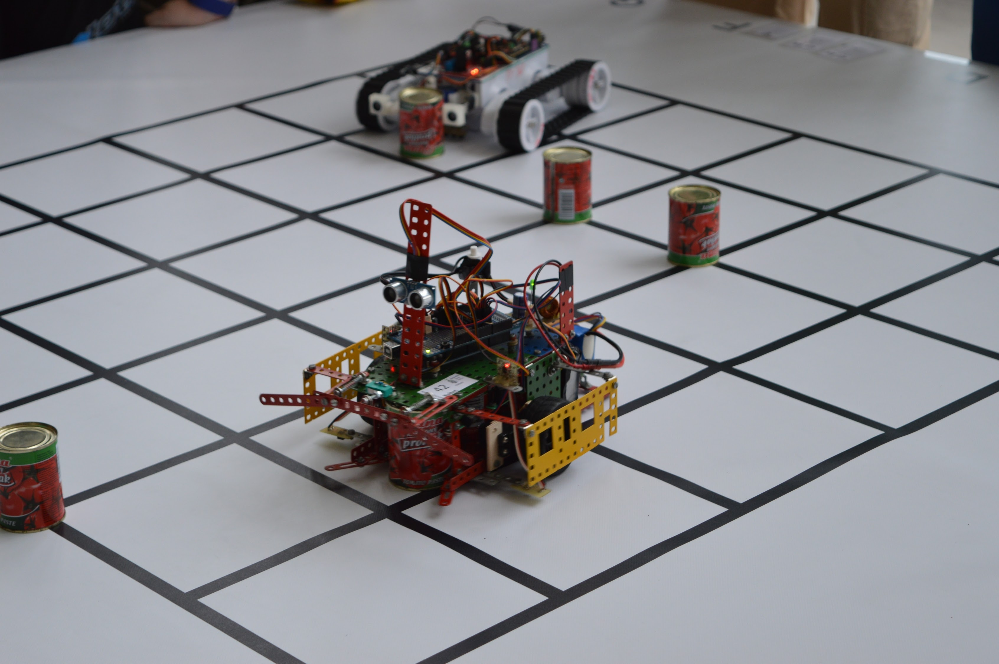

# Uvítání

Ahoj, rádi bychom vás přivítali na naší T-exkurzi a jsme velmi rádi, že jste si vybrali zrovna tu naši :-).

Ale dost povídání. Pojďme rovnou na to. V teoretické části si probereme, z čeho se takový robot skládá a jaké všechny komponenty potřebuje. Následně se vrhneme do základu programovacího jazyka C/C++.

V praktické části si vyzkoušíte ovládat virtuálního robota, který je věrnou kopií našich robotů, které máme k dispozici a s kterými si budeme také hrát v rámci T-exkurze.

Na závěr vás bude čekat menší programátorský testík, tak abyste nám ukázali, že jste se do materiálů podívali a zkusili si zprovoznit virtuálního robota.

Nyní je k Vám k dispozici teoretická část materiálů. Praktická část a testík by měla být dostupná od 8.5.2016. Pokud budete mít dotaz, nebojte se s ním na nás obrátit. Rádi bychom během května vypsali i konzultační hodiny. kdy vám budeme k dispozici na Skypu.

# Co to ten robot vlastně je? 

Robot může mít mnoho podob. Většině z vás se asi vybaví terminátora, R2-D2 nebo Číslo 5 žije.


{ width=70% }

Robotem ovšem nazýváme i kuchyňský mixér, robotický vysavač podlahy nebo autonomní stroje jezdící na herním hřišti.

{ width=95% }

<!---
Roboti ze soutěže Ketchup House, která se koná každoročně v rámci 
Robotického dne v Praze
--->

Vidíte tedy, že představa o tom, co je to tedy robot může být různá. My se budeme bavit o jednodušších autonomních robotech, zaměřených na plnění soutěžních úloh, jak můžete například vidět na obrázku výše.

# Z čeho se robot skládá

V této kapitole probereme jednotlivé části robota: pohony, senzory, řídící elektronika, napájení

##Pohony 

Pohon je zařízení, které uvádí celého robota do pohybu. Pohony se většinou skládají z motoru a převodovky. Motor může být buď stejnoměrný nebo střídavý. Pokud nás v praxi zajímá to, jak se motor otáčí, nebo jakou má zrovna teď polohu, můžeme k němu připojit enkodér. Více si o enkodéru povíme v kapitole senzory. 

## Senzory

### Ultrazvuk

Ultrazvukový senzor je zařízení, které za pomocí ultrazvukových vln, době jejich letu a schopnosti odrazu, dokáže určit vzdálenost od překážky. Jeho konstrukce obsahuje piezo měnič, který generuje ultrazvukové vlny. Tyto vlny se při nárazu na překážku vrací zpět.

### Infračervený senzor

Infračervený senzor je zařízení, které určuje vzdálenost pomocí světelných paprsků, které jsou na bázi neviditelného světelného spektra. Vyslaný paprsek se odrazí, vrátí zpět a dopadá na fotodiodu. Zpětná intenzita paprsku závisí na vzdálenosti, kterou musel paprsek urazit.

Infračervený senzor lze také použít pro měření odrazivosti (například při sledování černé čáry na bílem povrchu). Odrazivost povrchu může také velmi ovlivňovat naměřenou vzdálenost.

### Mechanický senzor

Mezi senzory můžeme zařadit i mechanické prvky jako tlačítko či přepínač. Robot reaguje na sepnutí nebo přepnutí a následně po této změně vykoná danou akci. Jedná se o nejjednodušší variantu senzoru a proto se s ní lze setkat dost často.

### Enkodér

Enkodér je zařízení, které umožňuje získat informace o poloze, rychlosti nebo ujeté vzdálenosti (v závislosti na jeho typu a způsobu zpracovávání informací). Lze jej připojit k motoru, ale může být upevněn i u kola robota nebo jakémukoliv pohybujícímu se prvku. 
	
## Řídící elektronika

Řídící elektronika zajišťuje ovládání všech částí robota a zároveň vykonává předprogramovanou sadu příkazů. V závislosti na datech ze senzorů může upravovat chování robota. Řídící elektronika může být buď jako jedna deska plošných spojů (DPS), nebo se může jednat o více samostatných DPS rozdělených podle zaměření (silová elektronika, senzory, hlavní řídící číp/logika).

Srdcem každé řídící elektroniky je procesor. Prakticky se jedná o “mozek” elektroniky. Procesor vykonává všechny matematické a logické operace. Vykonává daný program. Může komunikovat s ostatními periferiemi. 

Pro komunikaci s řídící elektronikou lze využít Bluetooth nebo WiFi nebo sériovou linku (nejjednodušší varianta).. 

## Napájení

Napájení je jednou z nejdůležitějších částí robota. Napájení musí být vhodně umístěno na robotovi, aby mu neznemožňovalo pohyb a nesmí mu rozhodit těžiště. 

Robota lze napájet přes kabel, pomocí baterií, ale také bezdrátově. Většinou se dnes využívají baterie a to ať už klasické NiMH, Pb nebo z modernější typy jako Li-Pol, Li-Fe, Li-ion. U baterií Li-xxx je problém s jejich větší náchylností na zničení. Nesmíte je pod vybýt, dlouhodobě nechat nabyté na 100 % kapacity nebo například z nich brát moc velké proudy. I tyto problémy komplikují řešení napájení bateriových robotů.

# Základy programování

V této části se seznámíme se základy programovacího jazyka C/C++. Povíme si něco o proměnných, podmínkách, cyklech atd.

## Co je to program

Program je posloupnost příkazů, které musí počítač vykonat, aby splnil danou úlohu. My jako programátoři musíme vymyslet a zapsat program tak, aby vykonal, co chceme. U počítačů je ovšem jeden problém, dělají totiž přesně to, co jim naprogramujeme a ne to co bychom chtěli.

## Komentáře

Občas je dobré připsat si ke kódu poznámky, abychom časem věděli, proč jsme co napsali. V C++ jsou dva způsoby jak psát komentáře:
 
 * `//` Tyto dvě lomítka uvozují komentář, trvající do konce řádku. Jakýkoli text od těchto dvou lomítek do konce řádku je komentář a na překlad a běh programu nemá vůbec žádný vliv
 * `/* ... */` Tento styl komentáře je použitelný pro rozsáhlejší poznámky, neboť uvozovací sekvence `/*` může ležet klidně třeba 200 řádků před ukončovacím `*/`
 
Kromě poznámek mají komentáře ještě jednu důležitou funkci. Při ladění programu se často stává, že potřebujeme, aby se určitý již napsaný kus kódu prostě neprovedl. Jedna možnost, jak toho dosáhnout je tento kus kódu prostě ze zdrojového souboru vyjmout (případně si ho uložit do jiného souboru, abychom o něj nepřišli). To je ale občas nešikovné. Lepší je daný kus kódu takzvaně zakomentovat. Prostě ho označíme jako komentář a kompilátor ho při překladu bude ignorovat.

## Proměnná

Proměnná je kus paměti počítače, který si můžeme v programu vyhradit pro naše data. Proměnné se dělí podle toho, jaká data v nich chceme ukládat. Podle typu proměnné se při jejím vytvoření zabere správně velký kus paměti. Bohužel v C++ není velikost proměnných daná pouze jejich typem, ale závisí také na překladači. Proto se může stát, že stejná proměnná bude jinak velká na PC a na mikroprocesoru (uP). Velikosti proměnných v následující tabulce jsou vzaté experimentálně pro mikrokontroléry Atmel Mega (AVR Studio 5), které budeme využívat na naší T-exkurzi a PC (Microsoft Visual Studio 2010), které by měli odpovídat hodnotám v nástroji Qt pro práci v Simulátoru.

Všechny celočíselné proměnné (včetně typu `char`) se mohou vyskytovat ve dvou typech: se znamínkem (`signed`) a bez znamínka (`unsigned`). Proměnné se znamínkem mohou obsahovat kladná i záporná čísla (samozřejmě včetně nuly). Naopak proměnné bez znamínka mohou obsahovat pouze kladná čísla a nulu. Díky tomu jsou ale schopné pojmout dvakrát větší číslo než proměnné bez znamínka. Normálně jsou všechny proměnné se znamínkem. Potřebujeme-li proměnou bez znaménka, musíme ji při jejím vytváření uvodit slovem `unsigned`.

Desetinné proměnné (`float` a `double`) jsou vždy `signed`, nikdy nemohou být `unsigned`! Je to díky tomu jak jsou v PC implementovány.

**Základní datové typy u mikrokontrolérů Atmel Mega**

|  Název       |      Popis                           | Velikost [bajty]     | Rozsah                                                    |
| :----------: | :----------------------------------- | :------------------: | :-------------------------------------------------------- |
|  `bool`      | typ sloužící pro logické operace     | 1                    | může nabývat pouze hodnot 1 (`true`) nebo 0 (`false`)     |
|  `char`      | typ sloužící pro ukládání znaků      | 1                    | `signed`: -128 až 127                                     |
|              |                                      |                      | `unsigned`: 0 až 255                                      |
|  `int`       | celé číslo                           | 2                    | `signed`: -32,768 až 32,767                               |
|              |                                      |                      | `unsigned`: 0 až 65,535                                   |
|  `long`      | celé číslo                           | 4                    | `signed`: -2,147,483,648 až 2,147,483,647                 |
|              |                                      |                      | `unsigned`: 0 až 4,294,967,295                            |
|  `float`     | desetinné číslo                      | 4                    | ±3,4 * 10 ^±38^ (s přesností na 7 číslic)                 |
|  `double`    | desetinné číslo                      | 4                    | ±3,4 * 10 ^±38^ (s přesností na 7 číslic)                 |

<!-- 
| Název            | Popis                            | Velikost [bajty] | Rozsah                                                                    |
| :------------:   | :------------------------------: | :--------------: | :---------------------------------------------------------- |
| `bool`           | typ sloužící pro logické operace | 1                | může nabývat pouze hodnot 1 (`true`) nebo 0 (`false`)                     |
| `char`           | typ sloužící pro ukládání znaků  | 1                | `signed`: -128 až 127  `unsigned`: 0 až 255                               |
| `int`            | celé číslo                       | 2                | `signed`: -32,768 až 32,767  `unsigned`: 0 až 65,535                      |
| `long`           | celé číslo                       | 4                | `signed`: -2,147,483,648 až 2,147,483,647  `unsigned`: 0 až 4,294,967,295 |
| `float`          | desetinné číslo                  | 4                | ±3,4 * 10 ^±38^ (s přesností na 7 číslic)                                 |
| `double`         | desetinné číslo                  | 4                | ±3,4 * 10 ^±38^ (s přesností na 7 číslic)                                 |
-->
 
**Základní datové typy na PC**
 
| Název            | Popis                            | Velikost [bajty] |  Rozsah                                                                   |
| :-------------:  | :------------------------------: | :--------------: | :---------------------------------------------------------- |
| `bool`           | typ sloužící pro logické operace | 1                | může nabývat pouze hodnot 1 (`true`) nebo 0 (`false`)                     |
| `char`           | typ sloužící pro ukládání znaků  | 1                | `signed`: -128 až 127  `unsigned`: 0 až 255                               |
| `int`            | celé číslo                       | 4                | `signed`: -2,147,483,648 až 2,147,483,647  `unsigned`: 0 až 4,294,967,295 |
| `long`           | celé číslo                       | 4                | `signed`: -2,147,483,648 až 2,147,483,647  `unsigned`: 0 až 4,294,967,295 |
| `float`          | desetinné číslo                  | 4                | ±3,4 * 10 ^±38^ (s přesností na 7 číslic)                                 |
| `double`         | desetinné číslo                  | 8                | ±1.7 * 10 ^±308^ (s přesností na 15 číslic)                               |
 

Kompletní přehled datových typů jak pro mikrokontroléry tak PC můžete najít na <http://technika.tasemnice.eu/trac/wiki/cplusplus> 
 
<!-- 
Kompletní tabulka pro PC
| Název            | Popis                            | Velikost [bajty] |  Rozsah                                                                    |
| :------------    | -------------------------------- | :--------------: | -------------------------------------------------------------------------- |
| `bool`           | typ sloužící pro logické operace  | 1                | může nabývat pouze hodnot 1 (`true`) nebo 0 (`false`)                      |
| `char`           | typ sloužící pro ukládání znaků  | 1                | `signed`: -128 až 127 \ `unsigned`: 0 až 255                               |
| `short`          | celé číslo                       | 2                | `signed`: -32,768 až 32,767 \ `unsigned`: 0 až 65,535                      |
| `int`            | celé číslo                       | 4                | `signed`: -2,147,483,648 až 2,147,483,647 \ `unsigned`: 0 až 4,294,967,295 |
| `long`           | celé číslo                       | 4  | `signed`: -2,147,483,648 až 2,147,483,647 \ `unsigned`: 0 až 4,294,967,295 |
| `long  long int` | celé číslo                       | 8  | `signed`: -9,223,372,036,854,775,808 až 9,223,372,036,854,775,807 \ `unsigned`: 0 až 18,446,744,073,709,551,615 |
| `float`          | desetinné číslo                  | 4  | ±3,4 * 10 ^±38^ (s přesností na 7 číslic)                                              |
| `double`         | desetinné číslo                  | 8  | ±1.7 * 10 ^±308^ (s přesností na 15 číslic)                                              |
| `long double`    | desetinné číslo                  | 8  | ±1.7 * 10 ^±308^ (s přesností na 15 číslic)                                              |
-->

Dále se proměnné dělí na tzv. `lokální` a `globální`. Globální proměnné jsou vytvořené na začátku programu a jsou "viditelné" v celém programu. Naproti tomu lokální proměnné se vytvářejí uvnitř funkcí a jsou "viditelné" pouze ve funkci, ve které byly vytvořeny. Jejich nevýhodou je, že jakmile funkce skončí, všechny její proměnné zaniknou a ztrácí data. Obecně platí, že vytvořím-li proměnou uvnitř složených závorek, proměnná zaniká v okamžiku, kdy program dorazí k uzavírající složené závorce daného páru. Přesto ovšem doporučuji globální proměnné nepoužívat (vysvětlím u funkcí).

**Doporučení:** Pojmenovávejte proměnné podle toho, co do nich ukládáte! Budete-li mít v programu 26 proměnných pojmenovaných podle abecedy `a` až `z`, nevyzná se v tom nikdo jiný a za chvilku ani vy ne. Proto například počítám-li s kruhem, budu mít proměnné pojmenované `obsah`, `obvod` a `prumer`. Dále abyste se vyhnuli problémům, používejte v názvech proměnných pouze písmena anglické abecedy, podtržítko ( `_` ) a číslice (název ale nikdy NESMÍ číslicí začínat!).

**Upozornění:** C++ rozlišuje velikost písmen. To znamená, že proměnná `a` je jiná proměnná než `A`

```cpp
//příklad proměnné
//globální proměnné typu int
int napeti = 0; //se znaménkem 
unsigned int prumer = 4; //bez znaménka

int main()
{
    //lokální proměnné, dostupné pouze ve funkci main
    float obvod = 3.14 * prumer;

    double obsah; 
    /* Zde jsme sice vytvořili proměnnou obsah, ale nepřiřadili 
    jsme ji žádnou výchozí hodnotu.
    To doporučujeme nikdy nedělat. Proměnou byste měli mít vždy
    na začátku nastavit na výchozí hodnotu (např. 0), 
    i když hodnotu můžu přiřadit dodatečně (viz další řádek). */

    obsah = (3.14 * (prumer * prumer)) / 4;

    napeti = 5;
    char ch = 'a'; 
    /* Znakové konstanty píšeme do apostrofu, kdybychom na apostrofy 
    zapomněli, překladač by se snažil do proměnné "ch" uložit hodnotu 
    proměnné "a" která ovsem neexistuje. To by vedlo k chybě a program 
    by nesel přeložit. */

    //další kód    
} 
```

### Pole

Potřebuji-li pracovat s více hodnotami stejného typu (nejen datový typ, ale i stejný "význam"), použiji pole. V podstatě se jedná o několik proměnných se stejným názvem, rozlišených číslem (indexem).

Pole vytvoříme stejně jako normální proměnou, ale za její jméno napíšeme do hranatých závorek `[]` velikost pole (kolik bude mít prvků). Počet prvků pole nelze za běhu programu měnit. K prvkům pole potom přistupujeme tak, že napíšeme jméno pole následované opět hranatou závorkou s číslem prvku, se kterým chceme pracovat. **Pozor:** prvky jsou číslované od 0. Vytvoříme-li tedy pole 10 prvků, bude mít první prvek číslo 0 a poslední číslo 9. 

Pole si můžeme představit jako tabulku s jedním sloupcem a `n` (počet prvků pole) řádky. Můžeme ale mít i pole mající více rozměrů. Dvojrozměrné pole je tabulka mající `n` řádků a `m` sloupců. Při přístupu k jejím prvkům pak indexujeme napřed řádek, potom sloupec. Trojrozměrné pole si můžeme představit jako kvádr složený z malých krychliček z nichž každá představuje jeden prvek pole. Krychličky jsou pak indexované podle jejich Xové, Ypsilonové a Zetové souřadnice v kvádru. U čtyř a více rozměrových polí už normálním lidem selhává představivost :-).

Pozor, u vícerozměrných polí velmi rychle narůstá paměť potřebná k uložení pole. Mám-li jednorozměrné pole typu `int` (na PC, kde int má 4 bajty) o deseti prvcích, pak zabírá 40 bajtů paměti. Dvojrozměrné pole 10 x 10 prvků už ale zabírá 400 bajtů a třírozměrné 10 x 10 x 10 dokonce 4000 bajtů! Což u jednodušších mikrokontrolérů (např. v Arduinech - [ATmega328P](http://www.atmel.com/devices/atmega328p.aspx?tab=overview)) může být velký problém.


```cpp
//příklad pole
double pole1[15]; 
//vytvoření pole 15 proměnných typu double s názvem "pole1"
int pole2[4] = {2, 7, 8, -14}; 
//vytvoření pole 4 proměnných typu int s názvem "pole2" a jejich inicializace
char pole3D[4][5][2]; 
//vytvoření třírozměrného pole typu char

/*
int velikost = 10;
int pole[velikost];
Toto NELZE provést, počet prvku v poli musíme při jeho vytváření zadat číslem!
*/

// ...

pole1[13] = 16.715; 
// přiřazení hodnoty 16.715 do předposledního prvku (prvku s indexem 13) pole1

int i = 2;
++pole2[i]; //zvětšení hodnoty o jednu prvku s indexem i (2) pole "pole2"

pole3D[1][1][0] = 'a';

// ...
```

## Operátory 
### Aritmetické

|  operátor     | popis                                                                                      |
| :-----------: | --------------------------------------------------------------------------------           |
|  `a + b`      | sčítání                                                                                    | 
|  `a - b`      | odčítání                                                                                   | 
|  `a * b`      | násobeni                                                                                   | 
|  `a / b`      | dělení                                                                                     | 
|  `a % b`      | zbytek po celočíselném dělení (`8 % 3 = 2`)                                                | 
|  `++a`        | inkrementace (zvětšení o jednu) proměnné `a` (jinak řečeno `a = a + 1`)                    | 
|  `--a`        | dekrementace (zmenšení o jednu) proměnné `a` (jinak řečeno `a = a - 1`)                    | 
|  `-a`         | unární mínus ( `a * (-1)` )                                                                | 

### Bitové

|  operátor     | popis                                                                                      |
| :-----------: | --------------------------------------------------------------------------------           |
|  `a & b`      | bitový součin                                                                              |
|  `a | b`      | bitový součet                                                                              |
|  `a ^ b`      | bitový exklusivní součet                                                                   |
|  `a << b`     | bitový posun doleva                                                                        |
|  `a >> b`     | bitový posun doprava                                                                       |
|  `~a`         | negace                                                                                     |

### Logické

|  operátor     | popis                                                                                      |
| :-----------: | --------------------------------------------------------------------------------           |
|  `a && b`     | logický součin - výraz je pravdivý, pokud oba výrazy `a` i `b` jsou pravdivé               |
|  `a || b`     | logický součet - výraz je pravdivý, pokud alespoň jeden z výrazů `a` nebo `b` je pravdivý  |
|   `!a`        | negace - výraz je pravdivý právě tehdy, pokud výraz `a` není pravdivý a naopak             |

### Porovnávací

Používají se téměř výhradně v podmínkách.

|  operátor     | popis                                                                            |
| :-----------: | -------------------------------------------------------------------------------- |
|  `a == b`     | je pravda, pokud se hodnota proměnné  `a` rovná hodnotě proměnné  `b`            |
|  `a != b`     | je pravda, pokud se hodnota proměnné  `a` NErovná hodnotě proměnné  `b`          |
|  `a < b`      | je pravda, pokud je hodnota proměnné  `a` menší než hodnota proměnné  `b`        |
|  `a > b`      | je pravda, pokud je hodnota proměnné  `a` větší než hodnota proměnné  `b`        |
|  `a <= b`     | je pravda, pokud je hodnota proměnné  `a` menší nebo rovna hodnotě proměnné  `b` |
|  `a >= b`     | je pravda, pokud je hodnota proměnné  `a` větší nebo rovna hodnotě proměnné  `b` |

### Přiřazovací

|  operátor     | popis                                                                                              |
| :-----------: | --------------------------------------------------------------------------------                   |
|  `a = b`      | přiřazení hodnoty proměnné  b do proměnné  `a`                                                     |
|  `a += b`     | zvětšení hodnoty proměnné  `a` o hodnotu proměnné  `b` (jinak řečeno `a = a + b`)                  |
|  `a -= b`     | zmenšení hodnoty proměnné  `a` o hodnotu proměnné  `b` (jinak řečeno `a = a - b`)                  |
|  `a *= b`     | vynásobení hodnoty proměnné  `a` hodnotou proměnné  `b`, výsledek se uloží zpět do proměnné  `a` (jinak řečeno `a = a * b`) |
|  `a /= b`     | vydělení hodnoty proměnné  `a` hodnotou proměnné  `b`, výsledek se uloží zpět do proměnné  `a` (jinak řečeno `a = a / b`) |
|  `a %= b`     | vypočítá se zbytek po dělení proměnné  `a` proměnou `b` a uloží se do proměnné  `a` (jinak řečeno `a = a % b`) |
|  `a &= b`     | provede si bitový součin proměnné  `a` a `b` a výsledek se uloží do proměnné  `a` (jinak řečeno `a = a & b`) |
|  `a |= b`     | provede si bitový součet proměnné  `a` a `b` a výsledek se uloží do proměnné  `a` (jinak řečeno `a = a | b`) |
|  `a ^= b`     | provede si bitový exklusivní součin proměnné  `a` a `b` a výsledek se uloží do proměnné  `a` (jinak řečeno `a = a ^ b`) |
|  `a <<= b`    | proměnná `a` se posune o `b` bitů doleva (jinak řečeno `a = a << b`)                               |
|  `a >>= b`    | proměnná `a` se posune o `b` bitů doprava (jinak řečeno `a = a >> b`)                              |

### Priorita operátorů 
Co se ovšem stane, pokud máme v rámci jednoho výrazu více operátorů? Operátory mají různou prioritu (některé mají přednost před jinými) podle následující tabulky (čím nižší     úroveň, tím vyšší priorita daného operátoru). Z pravidla je priorita stejná, jak v matematice. Pokud je ve výrazu více operátorů se stejnou prioritou, postupuje se zpravidla zleva doprava.

|  úroveň  |  operátor                               | popis                                                    |
| :------: | --------------------------------------- | ----------------------------                             |
|  2       | `() [] ++ --`                           | postfix                                                  |
|  3       | `++ -- ~ ! sizeof`                      | prefix                                                   |
|  3       | `+ -`                                   | unární mínus (unární plus je v podstatě nesmysl)         |
|  6       | `* / %`                                 | násobení, dělení                                         |
|  7       | `+ -`                                   | sčítání, odčítání                                        |
|  8       | `<< >>`                                 | bitový posuv                                             |
|  9       | `< > <= >=`                             | porovnání velikosti                                      |
|  10      | `== !=`                                 | rovnost, nerovnost                                       |
|  11      | `&`                                     | bitový součin                                            |
|  12      | `^`                                     | bitový exklusivní součet                                 |
|  13      | `|`                                     | bitový součet                                            |
|  14      | `&&`                                    | logický součin                                           |
|  15      | `||`                                    | logický součet                                           |
|  17      | `= *= /= %= += -= >>= <<= &= ^= |=`     | přiřazovací operátory                                    |

Pokud si prioritou nejsem jistý, uzavřu podvýrazy mající přednost do kulatých závorek `()` jak v matematice.

Jak jste si asi všimly, nejsou v tabulce priority uvedeny všechny úrovně. To proto, že ne všechny operátory jsou na této stránce uvedeny a nechceme Vám zbytečně zamotat hlavu. Pokud by někdo měl zájem o kompletní seznam operátorů, doporučujeme [wiki](http://en.wikipedia.org/wiki/Operators_in_C_and_C%2B%2B) nebo [cplusplus.com](http://cplusplus.com/doc/tutorial/operators) (zde jsou i příklady použití). 

## Podmínka
Neboli větvení programu. Umožňuje na základě hodnoty nějakého výrazu rozhodnout, které bloky kódu se provedou, případně neprovedou.

```cpp
if (/*podmiňovací výraz*/)
{
    //blok příkazů, který se provede pokud je podmínka splněná
}
else
{
    //blok příkazů, který se provede pouze pokud podmínka neplatí
}
//zbytek kódu, který se provede nezávisle na podmínce
```

Větev `else` není povinná.

Je-li potřeba na základě různých hodnot jedné proměnné  provést různé operace, je možné navěsit za sebe více podmínek.

```cpp
if (/*podmiňovací výraz 1*/)
{
    //blok příkazů 1
}
else if (/*podmiňovací výraz 2*/)
{
    //blok příkazů 2
    //provede se pouze pokud výraz 1 neplatí, ale platí výraz 2
}
else if (/*podmiňovací výraz 3*/)
{
    //blok příkazů 3
    //provede se pokud platí pouze výraz 3
}
else
{
    //blok příkazů 4
    //provede se pouze pokud žádný z předchozích výrazů neplatí
}
```

Podmínky je také možné vnořovat.

```cpp
if (/*podmiňovací výraz 1*/)
{
    //kód zde se provede pokud platí první podmínka
    if (/*podmiňovací výraz 2*/)
    {
        //tento blok kódu se provede pouze pokud jsou obě podmínky splněné
    }
    else
    {
        //tento kód se provede pouze pokud platí první a neplatí druhá podmínka
    }
    //tento kód se provede pokud platí první podmínka, na druhé vůbec nezávisí
}
//tento kód není závislý na žádné podmínce
```

**Příklad:**

```cpp
if (a == 10) //pokud proměnná a má hodnotu 10
{
    a = 0; //přiřaď do proměnné  a hodnotu 0
}
else
{
    a = a + 1; //jinak hodnotu proměnné  a zvětši o 1
}
```

### Pro pokročilejší:

Jakýkoli výraz v podmínce se převádí na číslo. Pokud je výsledek výrazu 0, podmínka není splněná. Naopak podmínka je splněná pro jakékoli číslo různé od 0.

## Příkaz switch

`switch` se používá, pokud potřebujeme na základě hodnoty jedné proměnné  rozhodnout, co bude program dělat. Stejného výsledku se dá dosáhnout pomocí `if`/`else`, ale `switch` je elegantnější.

```c
switch(/*proměnná podle které se rozhoduje*/)
{
    case /*hodnota 1*/:
        /* příkazy, které se provedou pokud hodnota řídící proměnné odpovídá 
        hodnotě napsané za case příkazy mohou byt přes více řádků */

        break; /*příkaz ukončující návěstí case; po tomto příkazu se provede 
             první příkaz za složenou závorkou uzavírající switch kdyby tu 
             break nebylo, k žádnému skoku nedojde a začnou se provádět 
             příkazy za následujícím case*/


    case /*hodnota 2*/:
        //příkazy
        break;

    // ...

    case /*hodnota n*/:
        // příkazy
        break;

    default: /*kód za default: se provede pokud hodnota řídící proměnné 
             neodpovídá žádnému case*/
          // příkazy
          break;
}
```

`switch` se nedá použít k porovnávání dvou proměnných, hodnota všech `case` včetně `default` musí být konstanta.

**Pozor:** `case` fungují pouze jako jakási návěští, na které program skočí po `switch` a od nich pokračuje dál. Další `case` běh programu nijak neovlivní a pokračuje se příkazy za ním následujícími, dokud se nenarazí na `break;` nebo `switch` neskončí. Toho se dá využít například potřebujeme-li pro více hodnot řídící proměnné  provést stejnou akci.

## Cyklus `for`
Používá se pokud chceme nějaký kus kódu několikrát opakovat a víme kolikrát. Například mám tabulku `n` hodnot a potřebuji každou hodnotu zvětšit o 1.
Aby mohl cyklus počítat kolikrát už proběhl a kolikrát má ještě proběhnout, potřebuje tzv. řídící proměnou.

```cpp
for (/*inicializace/*; /*podmínka*/; /*aktualizace řídící proměnné */)
{
    //blok kódu, který se má opakovat
}
```

`inicializace` typicky definice a inicializace řídící proměnné ; provádí se pouze jednou před prvním provedením cyklu

`podmínka` se kontroluje před každým provedením cyklu; cyklus se provádí tak dlouho, dokud podmínka platí (tzn. nemusí se provést ani jednou)

`aktualizace řídící proměnné ` provádí se na konci každého průchodu cyklem

**Příklad:**

```cpp
for (int i = 0; i < 10; ++i)
{
    pole[i] += 1;
}
```

Co se vlastně děje?

* na začátku cyklu se vytvoří proměnná `i` s hodnotou 0
* zkontroluje se podmínka: je-li proměnná i menší než 10, cyklus se provede
   neplatí-li podmínka (proměnná `i` má hodnotu 10 nebo větší), cyklus skončí a program pokračuje prvním příkazem za tělem cyklu (za uzavírající složenou závorkou)
* provedou se příkazy v těle cyklu 
   prvek `i` pole `pole` se inkrementuje (jeho hodnota se zvedne o 1)
* provede se `++i` - inkrementace proměnné  `i`
* cyklus se vrátí na začátek na testování podmínky
 
Další velmi časté využití cyklu `for` je pro vytvoření tzv. nekonečné smyčky:

```cpp
for (;;)
{
    //blok kódu, který se má opakovat do nekonečna ( = do ukončení programu )
}
```

Stejně jako u podmínky, je možné mít v sobě vnořených několik cyklů.

## Cyklus `while` 

Používá se, pokud potřebujeme nějaký kus kódu opakovat dokud platí nějaká podmínka, ale nevíme kolikrát to bude. Typické použití například čekání, dokud uživatel nezmáčkne nějaké tlačítko.

```cpp
while (/*podmínka*/)
{
    //blok kódu, který se má opakovat
}
```

## Cyklus `do-while`
Velmi podobný cyklu `while`, ovšem s tím rozdílem, že testovaná podmínka leží až na konci cyklu. V praxi to znamená, že tělo cyklu se vždy alespoň jednou provede (což se u cyklu while stát nemusí).

```cpp
do
{
    //blok kódu, který se má opakovat
} while (/*podmínka*/);
```

**Nezapomeňte za** `WHILE()` ; *(středník)*

## Příkazy `break` a `continue` 
Příkazy `break;` a `continue;` se používají uvnitř cyklů k ovlivnění jejich chodu.

* Příkaz `break;` okamžitě přeruší provádění cyklu. Po `break;` se provede první příkaz následující za složenou závorkou uzavírající tělo cyklu.
* Příkaz `continue;` přeskočí zbytek příkazů v těle cyklu. V cyklu `while` nebo `do-while` skočí na testování řídící podmínky. V cyklu `for` se ještě před testováním řídící podmínky provede aktualizace řídící proměnné .

## Funkce

Kdybychom  měli celý program psát příkaz po příkazu tak jak jdou za sebou, byl by delší program za chvilku hrozně nepřehledný. Navíc určité kusy kódu by se často opakovaly, protože prostě často je potřeba dělat stejnou věc na různých místech programu. 

Způsob jak to udělat lépe jsou právě funkce. Vezmeme několik vzájemně souvisejících příkazů, dělajících dohromady nějakou konkrétní věc a zapouzdříme je do funkce. Když pak v programu potřebujeme tu věc provést, prostě zavoláme danou funkci a je to. 

Při volání můžeme funkci předat nějaké parametry a funkce nám může nějaký parametr vrátit.

Na příklad potřebujeme na různých místech programu počítat `a`^`n`^ (pro jednoduchost řekněme že `n` jsou celá kladná čísla včetně nuly). Na to v C++ neexistuje operátor, proto si na to musíme napsat vlastní funkci.

```cpp
//funkce umocni pro výpočet výrazu (a na n)
double umocni (double a, unsigned int n) 
/* zde jsme si vytvořili funkci jménem umocni; 
funkce vrací číslo typu double;
    funkci předáváme dva parametry:
    - číslo typu double, se kterým ve funkci pracujeme jako s proměnou a; 
    proměnná a je lokální (odnikud odjinud než z funkce umocni není vidět)
    - číslo typu unsigned int, ve funkci jako lokální proměnná n  */
{ /*vše co je v těchto složených závorkách se nazývá tělo funkce a provede se 
pokaždé když funkci zavoláme*/
    double vysledek = a; 
    /*vytvořili jsme si lokální proměnnou "vysledek" a inicializovali ji 
    hodnotou proměnné "a"*/

    if ( n == 0 ) 
    /*podmínka, obsah následujících složených závorek se provede pouze pokud 
    je v proměnné "n" nula*/
    {
          return 1; 
          /* příkaz return okamžitě ukončí provádění funkce, ma-li funkce 
          vracet hodnotu, musí byt tato hodnota za return napsaná
          (v tomto případě jedna, neboť cokoli na nultou je jedna) */
    }

    for(unsigned int i = 0; i != (n - 1); ++i) 
    //cyklus pro proměnou i od nuly do hodnotu "n" méně jedna
    {
        vysledek *= a; //násobení proměnné výsledek proměnou "a"
    }

    return vysledek; 
    //konec funkce; funkce zde vrací hodnotu proměnné "vysledek"
}

int main()
{
    double mocnenec = 4;
    unsigned int mocnitel = 3;
    double kolik = 0;

    //...

    kolik = umocni(mocnenec, mocnitel); 
    /* zde voláme naši funkci umocni a jako parametry ji předáváme hodnoty 
    proměnných "mocnenec" a "mocnitel" funkce nám vrátí spočítanou hodnotu 
    ("mocnenec" na "mocnitel"), kterou si uložíme do proměnné "kolik" */
}
```


Stejně jak u proměnných, doporučuji pojmenovávat funkce podle toho co dělají.

Z matematiky víme, že výstup funkce závisí pouze na jejím vstupu. Aby to byla pravda, nesmí funkci ovlivňovat žádné jiné faktory. V našem případě to znamená, že návratová hodnota funkce závisí pouze na parametrech, které funkci předáme (toto se samozřejmě netýká funkcí, po kterých chceme například vracet kód uživatelem stisknuté klávesy apod.). Proto by do funkce neměly zasahovat takové věci jako globální proměnná (samozřejmě existují výjimky, kdy vyhnout se použití globální proměnné  ve funkci je prakticky nerealizovatelné). A nemáme-li ve funkcích používat globální proměnné , pak není důvod je mít, jak už jsem psal výše.

### Rekurzivní funkce 
Uvnitř funkce mohu volat jiné funkce. Speciální případ je, když funkce ve svém těle volá sama sebe. Takovéto funkci se pak říká rekurzivní. Rekurzivní funkce se dají využít například pro vše zmíněný výpočet mocniny, faktoriálu, nebo třeba pro setřídění pole podle velikosti (samozřejmě to jde i bez rekurze a možná i lépe). Především na mikroprocesorech je ale třeba si uvědomit, že při zavolání každé funkce se někam do paměti ukládá, odkud ta funkce byla volána, aby se tam program po dokončení volané funkce mohl vrátit. Budu-li tedy mít funkci, která uvnitř svého těla volá sama sebe, a to celé se mi opakuje 100x, budu mít v paměti uložených 101 návratových adres (100x rekurze + odkud byla funkce poprvé zavolána). To se na PC nějak přežije (a když ji zavolám 100 000 000?), ale na mikroprocesoru s malou pamětí to povede ke kolapsu programu. A takovéto chyby se pak velice obtížně hledají. Proto s rekurzí velice opatrně!


## Knihovny 
V okamžiku, kdy mám napsáno několik funkcí, zajišťujících například obsluhu nějaké periferie, je vhodné tyto funkce vyjmout z hlavního zdrojového souboru a vytvořit pro ně soubor vlastní (vhodně pojmenovaný). Takto vytvořeným souborům se říká knihovny, nebo hlavičkové soubory. Zpravidla mívají příponu `.h`. K našemu programu pak takovou knihovnu připojíme pomocí příkazu `#include "/*jméno knihovny*/"` (pozor, za tímto řádkem není středník). Od tohoto okamžiku se můžeme chovat jako by celý obsah přiloženého souboru byl napsán v hlavním zdrojovém souboru.

Výhodou toho je, že takto vytvořenou knihovnu můžeme poté použít ve více programech a nemusím funkce do každého zvlášť kopírovat. Dále to zvedá přehlednost kódu - je-li dlouhý kód rozdělen po kratších kouscích do více souborů, lépe se čte (tedy pokud je rozdělení smysluplné - každý soubor se kompletně stará o jednu věc).

Standardní knihovny se připojují pomocí `#include </*jméno knihovny*/>`.

Pro seznam standardních knihoven na PC doporučuji stránky http://cplusplus.com/reference/. Jsou sice anglicky, ale najdete zde kompletní standardní knihovny i s příklady použití.

Nejpoužívanější knihovny na mikroprocesorech Atmel:

|  knihovna         | popis                                                                                              |
| :---------------- | --------------------------------------------------------------------------------                   |
|  avr/io.h         | pojmenování registrů procesoru, první soubor který se připojuje |
|  avr/interrupt.h  | obsluha přerušení |
|  math.h           | knihovna matematických funkcí; v AVR Studiu 5 nezbytná pro funkci knihovny delay |
|  util/delay.h     | knihovna obsahující funkce pro tzv. bussy wait (prostě pro čekání určitý čas) |
|  avrlib           | soubor knihoven pro mikroprocesory Atmel napsaný u nás na Robotárně |
|                   | ke stažení <http://technika.tasemnice.eu/trac/browser/avrlib> |


# Pozvánka na naše další akce

Pokud byste si chtěli robotické a programátorské znalosti dále rozšiřovat, tak přes letní prázdniny pořádáme několik akcí se zaměřením na robotiku, elektroniku, 3D návrh a programování. Podívejte se, zda by vás také nelákaly? :-)

## Seznam akcí

**Robotický tábor 2016 - Naučme se s Arduinem**  
sobota 9. 7. – sobota 16. 7. 2016  
<http://robotikabrno.cz/robotarna/tabory/roboticky-tabor-2016>

**Příměstský tábor 2016 - Naučme se s Arduinem**  
pondělí 8. 8. – pátek 12. 8. 2016 (od 9:00 do 16:00)  
<http://robotikabrno.cz/robotarna/tabory/primestsky-tabor-2016>

**Třídenní kurzy**  
Základy 3D modelování  
Základy návrhu plošných spojů  
pondělí 15. 8. – středa 17. 8. 2016 (od 9:00 do 17:00)  
<http://robotikabrno.cz/robotarna/kurzy/kurzy-eagle-a-solidworks-2016>