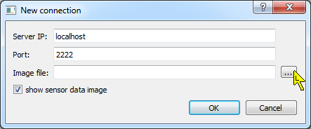
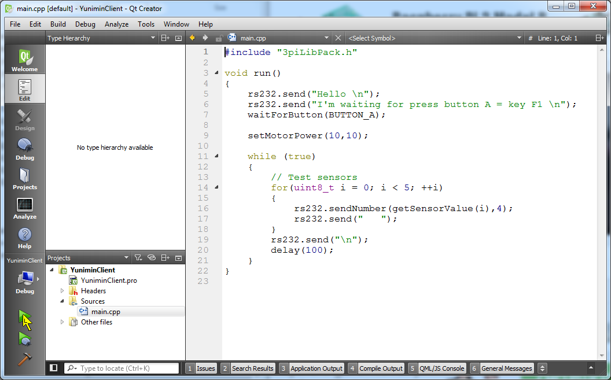
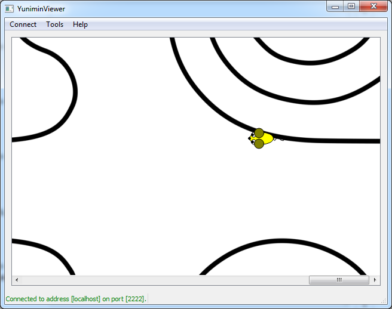

\newpage

# Praktická část

V této kapitole si vyzkoušíme rozpohybovat robota. Nejprve si doma zkusíte naprogramovat robota ve virtuálním simulátoru a pak si v rámci T-exkurze pohrajeme s reálným robotem.

{ width=80% }

Jako virtuální simulátor využijeme aplikaci, kterou naprogramoval Bedřich Said v rámci svojí práce SOČ. Její název je [Simulátor Yunimin](https://bitbucket.org/bsaid/simulator-yunimin) (pozn. název vznikl podle našeho nejstaršího výukového robota Yunimin, simulátor je ale univerzální a my ho budeme využívat pro robota Pololu 3pi). 

## Jak rozběhnout simulátor

Pro zprovoznění simulátoru budete nejprve potřebovat nainstalovat vývojové prostředí pro Qt framework. Qt framework je soubor knihoven pro multiplatformní vývoj. Umožňuje vám  naprogramovat aplikaci, která prakticky bez jakýchkoliv úprav (stačí pouze překompilovat) bude fungovat jak na Windows, tak na Linuxu i na Macu. To je taktéž jeden z důvodů, proč využíváme toto vývojové prostředí. Bohužel momentálně máme problém s jednou částí simulátoru a proto jej lze zatím provozovat jen na Windows.

### Instalace prostředí Qt

Stáhněte si vývojové prostředí pro Qt (Qt Creator) ze [`stránek výrobce`](https://www.qt.io/download-open-source/). Zvolte si vhodnou verzi dle vašeho operačního systému (32/64-bit) a nainstalujte jej. Nejlepší volba pro vás je [`Qt 5.6.0 for Windows 32-bit (MinGW 4.9.2, 1.0 GB)`](http://download.qt.io/official_releases/qt/5.6/5.6.0/qt-opensource-windows-x86-mingw492-5.6.0.exe). Pokud máte v PC nainstalováno Visual Studio 2013/2015 můžete zkusit verzi VS 2013/2015, ale nemůžeme zaručit, že vše poběží správně.

### Stažení simulátoru

Po stažení a nainstalování prostředí si musíte [`stáhnout Simulátor Yunimin`](https://bitbucket.org/bsaid/simulator-yunimin/downloads). Vyberte nejaktuálnější archiv (při psaní návodu to byla [`SimulatorYunimin1.0.4.zip`](https://bitbucket.org/bsaid/simulator-yunimin/downloads/SimulatorYunimin1.0.4.zip)). Po stažení archivu jej rozbalte do vašeho pracovního adresáře. (Poznámka: u verze 1.0.3 nastal konflikt s knihovnami Qt 5.6, verze 1.0.4 tento problém řeší)

### Spuštění simulátoru

Simulátor se skládá ze tří samostatných aplikací. Základním stavebním kamenem je server, na kterém běží samotná simulace. Vy jako uživatel si můžete průběh simulace prohlížet pomocí vieweru. Server i viewer spustíte jako samostatné .EXE soubory. Pro vás jako uživatele je ale nejdůležitější klient. Ten umožňuje spouštět jednotlivé simulace vašich robotů.

### Server - spuštění

{ width=80% }

Pro spuštění serveru otevřete složku `YuniminServer` ve staženém archivu a spusťte soubor `YuniminServer.exe`. Po spuštění by se měl objevit terminál (Command-line interface), na kterém uvidíte informace ze serveru. (Poznámka: je možné, že se vám při spouštění aplikace v systému Window\ 10 a možná i Windows\ 8 zobrazí hláška, že se jedná o neznámí program a že nedoporučují jej spouštět, věřte prosím ale naším aplikacím a rozklikněte si podrobnosti této hlášky, kde se vám následně zobrazí i tlačítko 'Spustit')

### Viever - spuštění

Viewer spustíte podobně jako server. Je potřeba otevřít složku `YuniminViewer` a v ní spustit soubor `YuniminViewer.exe`.
Otevře se vám okno zobrazující simulátor.

{ width=80% }

Po startu programu je ovšem ještě třeba viewer připojit k serveru (tyto dvě aplikace běží zcela nezávisle a například server může běžet na úplně jiném počítači, než viewer nebo klient).
To provedeme tak, že si v horní nabídce otevřeme `Connect` a vybereme `Connect to server`. Následně se nám zobrazí okno s nastavením připojení. 

{ width=80% }

\newpage

Jelikož nám server běží lokálně na našem počítači (neběží jako veřejný server, ke kterému by se dalo přistupovat přes internet) ponecháme `Server IP` a `Port` tak jak jsou přednastaveny. Pro správné zobrazení ovšem potřebujeme načíst `Image file`, který je v serveru nastaven jako podklad a podle kterého nám robot bude vracet hodnoty podkladu pod jeho senzory.

{ width=80% }

Rozklikneme tedy nabídku pro výběr cesty k souboru (`...`) a otevřeme soubor, který je umístěn v  `YuniminServer\textures\line_robotiada_pdfcreator_small.png` (jedná se o tréningové hřiště pro jízdu s robotem po čáře) a potvrdíme připojení.

Nyní je již viewer připojen k serveru a zobrazuje aktuální stav simulátoru. Ovšem v simulátoru se teď nic neděje, protože jsme ještě nepřipojili našeho robota.

{ width=75% }

\newpage

### Client - otevření projektu

Váš robot bude simulován pomocí klienta. Jeden klient připojený k serveru odpovídá jednomu simulovanému robotovi. Program, který napíšete, bude zkompilován (převeden do spustitelného programu) jako součást klienta. To je důvod, proč jsme si instalovali prostředí Qt, které nám jednoduše program zkompiluje. Qt Creator spustíte tak, že ve složce `YuniminClient` si otevřete soubor `YuniminClient.pro`. Po otevření tohoto souboru by vám měl naběhnout Qt Creator s otevřeným projektem `YuniminClient`.

V projektu rozklikneme složku `Source` a poklepáním otevřeme soubor `main.cpp`.

{ width=100% }

\newpage

Nyní byste měli vidět zdrojový kód programu pro vašeho robota, s předpřipraveným ukázkovým kódem, předvádějícím práci s komunikační linkou, tlačítky, motory a senzory. 

{ width=100% }

\newpage

### Client - nastavení projektu

Za chvíli si tento program zkusíme spustit, ale ještě před tím musíme zkontrolovat nastavení projektu. Proto si otevřeme nabídku `Projects` v levé boční liště (viz žlutá šipka v obrázku \ref{1.3.2 YC-QT - open project setting}).

{ width=100% }

V nabídce `Projects` lze nastavit prakticky vše k danému projektu. Od konfigurace kompilace až po nastavení editoru textu v Qt (jak chcete odsazovat text, jakou barvu mají mít jednotlivé konstrukce jazyka, kolik mezer má představovat jeden tabulátor atd.). 

Po otevření nabídky musíte ověřit zda je deaktivované políčko `Shadow build`, které umožňuje kompilaci/buildování programu mimo adresář se zdrojovým kódem. My ale pro správnou funkčnost klienta potřebujeme zajistit kompilaci/buildování v rámci adresáře se zdrojovým kódem. Pokud je tedy políčko `Shadow build` aktivováno, tak jej kliknutím deaktivujte a nastavení uložte (`CTRL + S`).

Nyní se můžeme vrátit do editoru pomocí ikonky `Edit` v levé boční liště a přejdeme ke spuštění našeho programu/robota.

{ width=100% }

\newpage

### Client - spuštění programu

Pro spuštění programu je potřeba kliknout na zelenou šipku v levé boční liště (ta bez brouka :-)), případně můžete použít i klávesovou zkratku `CTRL + R`. Šipka s broukem slouží pro takzvaný debug režim. Díky tomuto režimu lze krokovat program po jednotlivých řádcích a zjišťovat, co se kde děje. Krokování se využívá převážně při hledání chyb, což momentálně není náš případ.

{ width=100% }

Po zmáčknutí zelené šipky začne probíhat `Build`, což nám indikuje ukazatel v pravém dolním rohu. Pokud proběhne vše v pořádku, tak se ukazatel zaplní zelenou barvou a program se spustí.

Pokud se program nespustil, tak QT Creator narazil při kompilaci/buildování na chybu, která neumožňuje vytvořit a spustit program. Ve spodní liště by se pak měla otevřít nabídka `Issues` a v ní by měly být vypsány všechny problémy nalezené při kompilaci. V případě, že na podobný problém narazíte, snažte se řešit problémy od prvního k poslednímu a pokaždé, když si myslíte, že jste odstranili alespoň jednu chybu, tak program znovu zkompilujte. Často se totiž stává, že jedna chyba generuje několik `Issues/Errorů`, tudíž po odstranění první chyby mohou zmizet i všechny další. 

{ width=100% }

\newpage

Když program naběhne, zobrazí se nám terminál. Pokud vše proběhne v pořádku, měli byste v něm vidět přesně to stejné jako na obrázku \ref{1.4.2 YC-QT-Terminal - open}. Znamená to, že program se spustil, připojil k serveru a již čeká jen na zmáčknuti tlačítka `F1`. Pokud se tak nestane, pravděpodobně není spuštěn server nebo se nepodařilo načíst konfigurační soubor (možná jste vynechali krok s `Shadow build`).

{ width=100% }

\newpage

### Viewer - po spuštění programu

{ width=80% }

Ve vieweru se nyní objevila `myš`, která představuje vašeho robota. Vzhled robota je pevně nastaven a momentálně se nedá změnit. 

\newpage

### Server - po spuštění programu

Server by měl zobrazit připojení nového klienta (poslední dva řádky  na obrázku \ref{1.4.5 YS-Terminal - client connected}).

{ width=80% }

\newpage

### Client - rozjetí robota

Přejděte do terminálového okna klienta a zmáčkněte klávesu `F1` (na reálném robotovi jsou umístěny tlačítka A, B, C - v rámci simulátoru jsou tyto tlačítka namapovány na klávesy `F1` až `F3`). V terminálu se začnou vypisovat aktuální hodnoty ze senzorů (obr. \ref{1.4.6 YC-Terminal - run robot}). Ve vieweru lze sledovat pohyb tohoto robota (obr. \ref{1.4.7 YV - program run}). Robot by měl jet pořád doleva podél černé čáry.

{ width=80% }

\newpage

### Viewer - běžící program

{ width=80% }

\newpage

### Client - zastavení programu

{ width=80% }

Program robota zastavíte tak, že se přepnete do klientova okna terminálu a zmáčknete klávesovou zkratku `CTRL + C`. Tím se ukončí vykonávání programu (obr. \ref{1.4.8 YC-Terminal - program stoped}), klient se odpojí od serveru (obr. \ref{1.4.9 YS-Terminal - client disconnected}) a robot zmizí z vieweru.

\newpage

### Server - odpojení klienta

{ width=80% }

Pokud budete chtít server vypnout, stačí zadat `exit` a stisknout `Enter` nebo můžete použít klávesovou zkratku `CTRL + C`.

\newpage

### Client - jdeme programovat

{ width=100% }

Nyní již víte, jak obsluhovat simulátor a můžete tedy začít programovat robota.

\newpage

## Jak programovat robota

V rámci T-exkurze budeme pracovat s robotem [Pololu 3pi](https://www.pololu.com/product/975). Simulátor je proto nastaven tak, aby se chování virtuálního robota co nejvíce podobalo reálnému.

### Popis robota Pololu 3pi

Robot Pololu 3pi je robot určen na rychlou jízdu po čáře. Zároveň je ale udělán tak, aby s ním mohl začít i nováček v oblasti programování mikrokontrolérů. 

{ width=55% }

Jak již název napovídá, robot bude mít co dočinění s $3 \cdot \pi$.  Jeho průměr je totiž roven $3 \cdot \pi$ (cca. 9,5 cm). Robot je vybaven mikrokontrolérem Atmel ATmega328P, 5 senzory odrazivosti pro snímání podkladu, 3 tlačítky, 2 motory, displejem a bzučákem.

V simulátoru lze využít většinu součásti robota až na displej a bzučák, které zatím nejsou v simulátoru implementovány.

### Programování robota

Pro robota Pololu 3pi nachystal Vojta Boček knihovnu, která usnadňuje jeho programování. Knihovna obsahuje prakticky vše, co robot může dělat. Dokumentaci knihovny naleznete na jeho webových stránkách: <https://github.com/Tasssadar/3piLib/wiki>.

Jak již ale bylo řečeno, simulátor nepodporuje displej a bzučák, takže tyto komponenty nelze v simulátoru využít.

### Jak začít

Na začátek bude nejlepší upravit si zdrojový soubor `main.cpp` v klientovi tak, že odstraníte vše uvnitř funkce `void run()` a budete si postupně zkoušet jednotlivé funkce.

Zkuste si rozjet robota tak, aby jezdil do kruhu, pak můžete zkusit s robotem jezdit ve spirále, objet obdélník, trojúhelník, měnit velikost jednotlivých stran a podobně (zkuste použít i složitější konstrukce jazyka C++ jako podmínka a cyklus).

Pro inspiraci přidáváme odkaz na ukázku jednoduchých programů (možná bude třeba pro simulátor doladit časové konstanty - `delay()` v ukázkových programech): <http://robotikabrno.cz/robotika-brno/navody/robot-pololu-3pi>.

## Zadání úkolu

Až si projdete jednotlivé funkce a vyzkoušíte si, co vše s robotem lze dělat, můžete přejít na řešení úkolu (není to tedy úplně podmínkou, lze úkol vyřešit i bez vyzkoušení si simulátoru, ale chtěli bychom, aby jste si vyzkoušeli s robotem pracovat již doma a pak abychom již v rámci samotné T-exkurze mohli přejít ke složitějším věcem). 

Vaším úkolem bude navrhnout program (algoritmus), díky kterému bude robot jezdit po čáře. Chceme jen základní program nebo popis algoritmu. Snažte se navrhnout řešení, které bude založeno na funkci, která bude mít na vstupu jako proměnné hodnoty ze senzorů `S1` až `S5` (pro zjednodušení lze vynechat prostřední senzor) a na výstupu bude `error`, který následně budete přičítat nebo odčítat k jednotlivým motorům. Pokuste se vyhnout složitým konstrukcím s hromadou podmínek, které by řešili jednotlivé stavy, ale využijte výhodu funkce, která může snadněji řešit všechny stavy.

Vaše řešení odevzdejte do 30.\ května do informačního systému JCMM. Program odevzdávejte ve formě textového souboru, tak aby se dal jednoduše otestovat v simulátoru. Pokud budete odevzdávat slovní popis algoritmu, převeďte jej do PDF (vyhněte se odevzdávání Wordových dokumentů).
Na závěr prosím do poznámky uveďte, zda by vám více vyhovoval úterní (14.\ 6.\ 2016) nebo čtvrteční (16.\ 6.\ 2016) termín T-exkurze. Výsledky budou k dispozici do 5\ dnů po 30.\ květnu.

Pokud byste měli jakýkoliv problém nebo dotaz, nebojte se na nás obrátit. Rádi vám pomůžeme. Můžete nám napsat na <robotarna@robotikabrno.cz> nebo volejte na +420\ 603\ 366\ 463.

Doufáme, že se vám praktická část bude líbit a již se těšíme, až se s vámi osobně potkáme.
  

